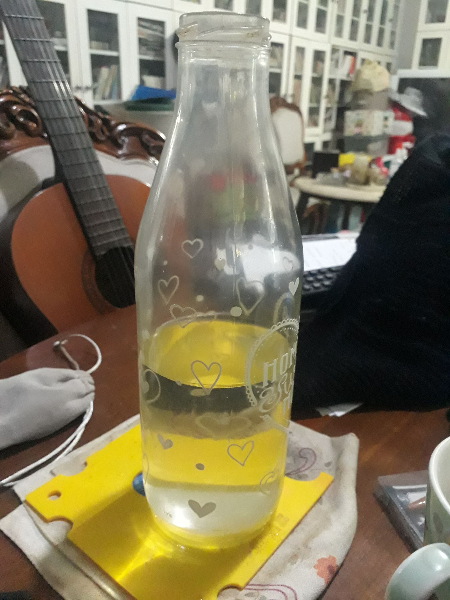
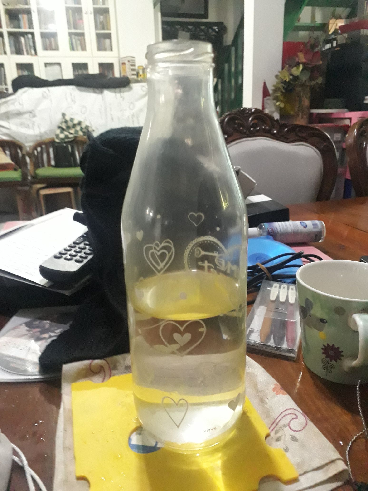
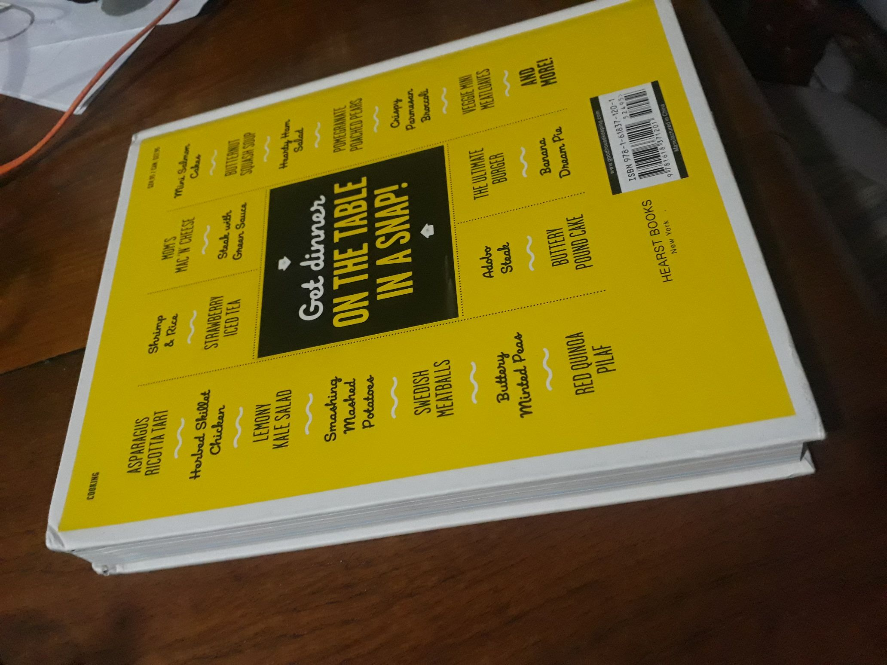
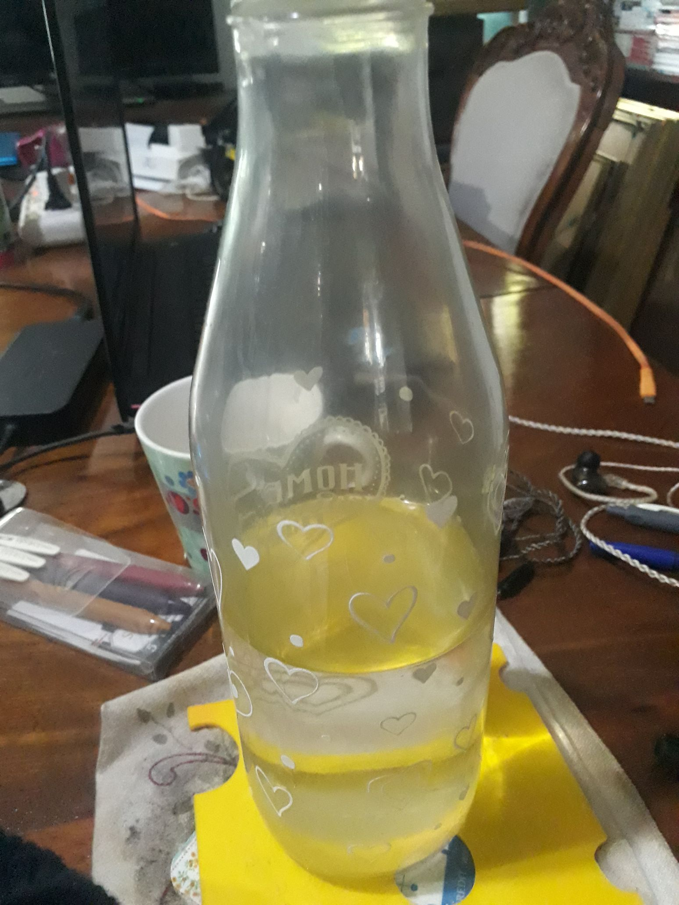

## TUGAS 1

|       NRP      |         Nama           |
|----------------|------------------------|
| 05111940000166 | Abiya Sabitta Ragadani |

Pada tugas pertama diminta untuk mencari benda disekitar yang berawalan B, G, atau L. Dan saya mendapatkan bendanya yaitu BOTOL.
Berikut ini adalah foto yang saya ambil dari buku tersebut.
 
Foto 1
 

 
Foto 2
 

 
Foto 3
 

 
Foto 4
 

